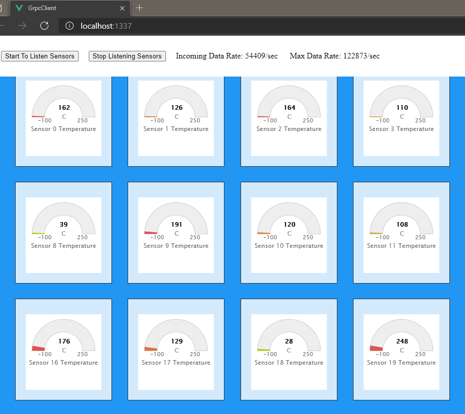

# gRPC Data Stream To Client

This is a **PoC** for testing grpc's usability with **VueJs** (with TypeScript) client and **.Net 5** server


## Prerequisites

- [.Net 5 SDK](https://dotnet.microsoft.com/download/dotnet/5.0)
- [Visual Studio 2019](https://visualstudio.microsoft.com/tr/vs/community/)
- NodeJs or NPM (Can install with Visual Studio)
- [VueJS](https://vuejs.org/v2/guide/installation.html)
- [protoc](https://github.com/protocolbuffers/protobuf/releases) (For compiling proto files) 
- [grpc-web](https://github.com/grpc/grpc-web) (For compilig proto files to js & d.ts files)
- [Docker](https://www.docker.com/products/docker-desktop) (Used for runnig service & proxy)

## Getting Started

Please read related documents about [gRPC](https://grpc.io/docs/what-is-grpc/introduction/) for further information.  

For a typical .net developer, we can say proto files are basically as interfaces. But .net is not natively support proto files, so this is why proto files need to be compiled to C# code. Visual Studio 19 handles this internally with using [grpc tools](https://www.nuget.org/packages/Grpc.Tools/), for working with grpc and .net please read the [microsoft docs](https://docs.microsoft.com/en-us/aspnet/core/tutorials/grpc/grpc-start?view=aspnetcore-5.0&tabs=visual-studio).

For using grpc with web frameworks we need to use [grpc-web](https://github.com/grpc/grpc-web) cause we genrally use js or typescript files at frontend code and protoc can not support them offically.  

In this PoC, both client and server is in the same solution and we can use server's protp files directly. But if you want to change this please read [grpc-web](https://github.com/grpc/grpc-web)'s documentation for protoc commands for web.   

#### How it works?

At the transport layer gRPC uses HTTP/2 for request/response multiplexing by which client and servers can both initiate multiple streams on a single underlying TCP connection. We're able to communicate between services or micro-services over HTTP/2 natively but not all browsers can use HTTP/2, some browsers still uses HTTP/1.1. At this point we wanted to stay at the safe point and decided to use a proxy to convert our packages from HTTP/1 to HTTP/2


## Quick Start

.Net Server is ready to run.
From the solution's root directory run those docker commands:  
```sh
$ docker-compose build
$ docker-compose up
```
To shutdown: `docker-compose down`.

For Client, you need to install neccessary npm packages at `package.json` and compile proto file.

From the client's root directory (/GrpcClient) run this command for installing npm packages:  
```npm
$ npm install
```
For compiling proto files use script named `proto`  defined at `package.json` file.

After those steps you can run client

## Scenario

On this PoC, Client creates a request for Eight thousand sensor and loads Highchats Gauge for every sensor. With buttons on the top you can create a stream request or cancel the request and stop the data flow.

> Note: Loading this many chart is a burden for a browser so I added extra control for rendering only charts visible on screen with scroll. This can be helpfull for you if you use Highcharts with many charts or series.

When you run the client you should see something like below:  
  
